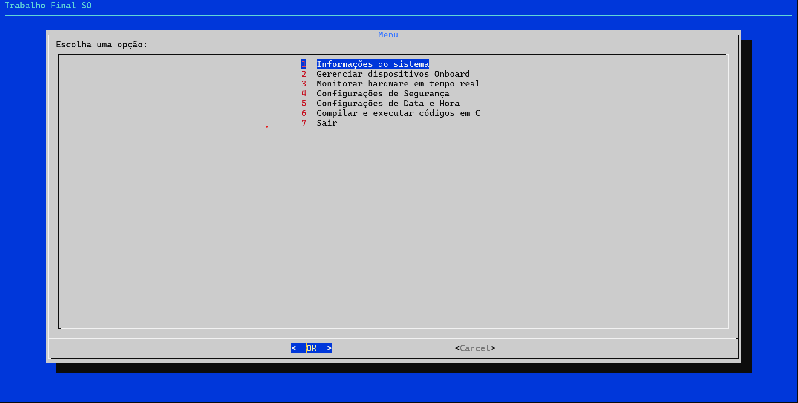
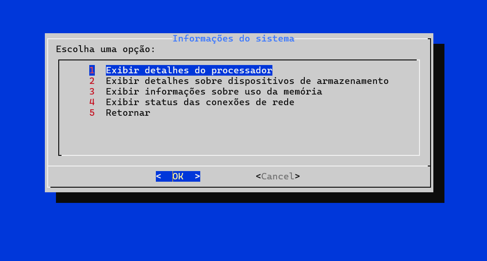
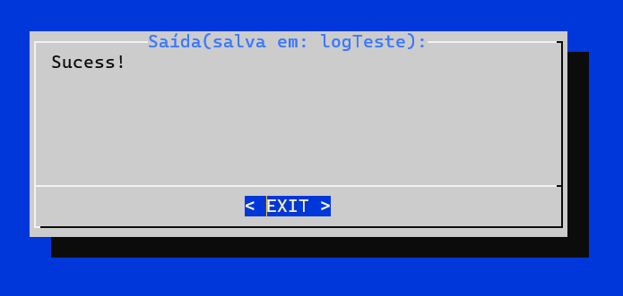
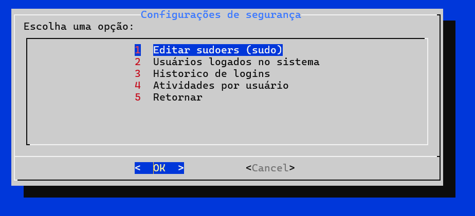

# Linux System Manager & BIOS Simulator (Bash)

A comprehensive Shell Script utility developed for the Operating Systems Lab at UNIFEI. This tool simulates a BIOS interface to monitor hardware and manage system configurations directly from the terminal.

## 🌟 Key Features
- **Hardware Monitoring:** Real-time data from CPU, RAM, Storage, and Network.
- **System Management:** Interface for Date/Time and Security configurations.
- **C-Dev Integration:** Built-in compiler and runner for C programs, including log generation for compilation errors.
- **TUI (Terminal User Interface):** Interactive menus built with `dialog`.

## 🛠️ Requirements
- Linux Environment
- `dialog` package installed (`sudo apt install dialog`)

## 🚀 How to use
1. Give execution permission: `chmod +x trabalhoSO.sh`
2. Run: `./trabalhoSO.sh`

## 📸 Interface Preview

Below are some screenshots of the BIOS-like interface running on a Linux terminal:

  
  

  
  

*From left to right: Main Menu, System Information Display, C Compiler & Execution Output, and Security Configuration.*
---
*Developed as a final assignment for the Operating Systems course.*